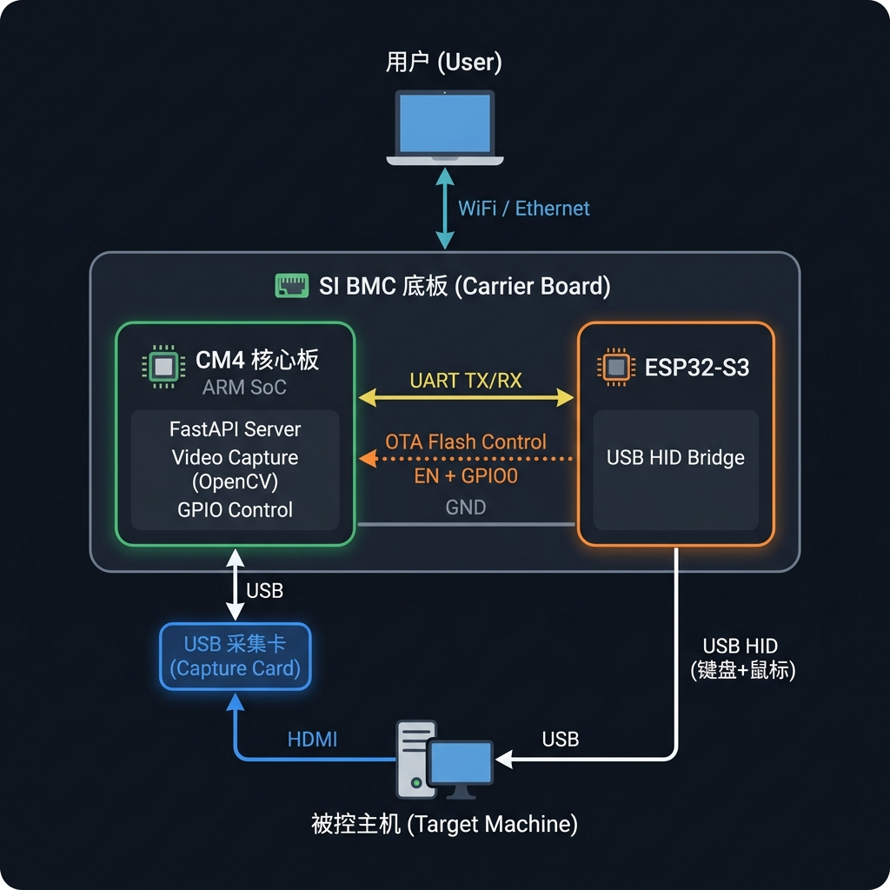

# SI BMC — 开发调试指南

本文档描述如何在开发环境中连接硬件、烧录固件、启动服务并进行逐步调试。

## 系统拓扑



---

## 目录

1. [你需要准备什么](#1-你需要准备什么)
2. [Step 1: 烧录 ESP32-S3 固件](#2-step-1-烧录-esp32-s3-固件)
3. [Step 2: 硬件接线](#3-step-2-硬件接线)
4. [Step 3: ARM 端软件部署](#4-step-3-arm-端软件部署)
5. [Step 4: 启动服务](#5-step-4-启动服务)
6. [调试方法](#6-调试方法)
7. [常见问题排查](#7-常见问题排查)

---

## 1. 你需要准备什么

### 硬件

| 物品 | 数量 | 说明 |
|------|------|------|
| CM4 核心板 + 底板 | 1 | 任意 CM4 标准核心板 (Orange Pi, Raspberry Pi, etc.) |
| ESP32-S3 开发板 | 1 | 推荐 ESP32-S3-DevKitC-1 或任意带 USB 口的 S3 板 |
| USB 采集卡 | 1 | MS2109 或兼容 UVC 采集卡 |
| 杜邦线 / 跳线 | 4-6 根 | 公对母或公对公，根据接口类型选择 |
| 1kΩ 电阻 | 2 | UART 线串联保护 (可选但推荐) |
| 10kΩ 电阻 | 2 | EN/GPIO0 上拉 (OTA 刷写时需要) |
| USB-A to USB-C 线 | 2 | 烧录 ESP32 + 连接被控主机 |
| 被控主机 (目标机) | 1 | 任意有 USB 口和 HDMI 输出的电脑 |

### 开发机软件

```bash
# macOS / Linux 开发机上安装
pip install platformio     # ESP32-S3 编译烧录
pip install esptool        # ESP32 刷写工具 (platformio 会自动安装)
```

### 网络

- CM4 核心板和你的开发机在**同一局域网**内 (WiFi 或以太网)
- 或者通过 USB-Serial 直接连接 CM4

---

## 2. Step 1: 烧录 ESP32-S3 固件

### 2.1 首次烧录 (通过 USB)

ESP32-S3 开发板通过 USB 线连接到你的**开发机** (macOS/Linux/Windows)：

```
开发机 (你的电脑)
  │ USB-C 线
  ▼
ESP32-S3 开发板 (USB 口标记为 "UART" 或 "COM")
```

> ⚠️ 注意：ESP32-S3-DevKitC-1 有两个 USB 口，首次烧录请用标有 **UART** 或 **COM** 的那个。

```bash
# 在开发机上执行
cd armhost\(cm4\)/esp32s3_hid

# 编译
pio run

# 烧录 (自动检测端口)
pio run --target upload

# 查看串口输出确认启动成功
pio device monitor --baud 115200
```

**预期输出**：ESP32-S3 板载 LED 闪烁 3 次 → 进入慢闪 (1Hz)，表示已就绪并等待 UART 数据。

### 2.2 后续更新 (OTA via ARM 主板)

配置好 OTA GPIO 后 (见 Step 2)，可以通过 Web 面板直接上传固件：

```bash
# 先在开发机编译， 获取 .bin 文件
cd armhost\(cm4\)/esp32s3_hid
pio run

# 编译产物路径:
ls .pio/build/esp32s3/firmware.bin
```

然后在浏览器打开 BMC 面板 → 上传 `firmware.bin`，或用 curl：

```bash
curl -X POST http://<ARM_IP>:8080/api/esp32/flash \
     -F "firmware=@.pio/build/esp32s3/firmware.bin"
```

---

## 3. Step 2: 硬件接线

### 3.1 最小接线 (仅 HID 功能，无 OTA)

只需 **3 根线**：

```
CM4 底板                          ESP32-S3 开发板
─────────                         ──────────────
UART TX (查底板丝印) ──────────→   GPIO43 (RX)
UART RX (查底板丝印) ←─────────   GPIO44 (TX)
GND     ──────────────────────→   GND
```

### 3.2 完整接线 (HID + OTA 刷写)

额外接 **2 根线 + 4 个电阻**：

```
CM4 底板                                ESP32-S3 开发板
─────────                               ──────────────
UART TX ──[1kΩ]──────────────────────→   GPIO43 (RX)
UART RX ←─[1kΩ]─────────────────────    GPIO44 (TX)
GPIO_A  ─────────────────┬──────────→   EN
                      [10kΩ]→ 3.3V
GPIO_B  ─────────────────┬──────────→   GPIO0
                      [10kΩ]→ 3.3V
GND     ──────────────────────────→     GND
```

### 3.3 连接被控主机

ESP32-S3 的 **另一个 USB 口** (标有 "USB" 或 "OTG") → 连接到**被控主机的 USB 口**：

```
被控主机                     ESP32-S3
─────────                   ──────────────
USB-A 口 ←── USB线 ──────── USB口 (GPIO19/20, 标 "USB")
HDMI 输出 ←── HDMI线 ──→ USB采集卡 ──USB──→ CM4核心板
```

### 3.4 查找 CM4 底板的 UART

不同底板 UART 引出位置不同。常见方法：

```bash
# SSH 到 CM4 核心板，查看所有串口设备
ls /dev/ttyS*  /dev/ttyAMA*  /dev/ttyUSB*  2>/dev/null

# 查看哪些串口可用 (不被内核控制台占用)
dmesg | grep tty

# 以 Orange Pi CM4 为例，UART1 通常在 40pin 排针的:
#   TX = 物理 Pin 8  (GPIO4_C4)
#   RX = 物理 Pin 10 (GPIO4_C3)
```

> 💡 如果不确定哪个引脚是 UART，可以先用示波器或万用表测量，或查阅底板原理图。

---

## 4. Step 3: ARM 端软件部署

### 4.1 SSH 到 CM4 核心板

```bash
ssh root@<CM4_IP>
# 或
ssh user@<CM4_IP>
```

### 4.2 安装依赖

```bash
# 安装 Python 3.8+ 和 pip
sudo apt update
sudo apt install -y python3 python3-pip python3-venv

# 安装系统级依赖 (视频采集)
sudo apt install -y v4l-utils libopencv-dev

# 创建项目目录
sudo mkdir -p /opt/si-bmc
sudo chown $(whoami) /opt/si-bmc

# 拷贝项目文件 (从开发机)
# 方法 A: scp
scp -r armhost\(cm4\)/* root@<CM4_IP>:/opt/si-bmc/

# 方法 B: git (如果项目在 git 仓库)
cd /opt/si-bmc && git pull
```

### 4.3 安装 Python 包

```bash
cd /opt/si-bmc
pip3 install -r requirements.txt
```

### 4.4 配置 config.yaml

```bash
nano /opt/si-bmc/config.yaml
```

**最关键的两项配置**：

```yaml
# 1. HID 串口 — 设为 auto 自动扫描, 或指定具体串口
hid:
  mode: "serial"
  serial_port: "auto"          # 或 "/dev/ttyS1"

# 2. ESP32 OTA GPIO — 设为你实际接的 GPIO 编号, 或保持 null 禁用
esp32_flasher:
  en_gpio: null                # 例如: 134
  boot_gpio: null              # 例如: 135
```

---

## 5. Step 4: 启动服务

### 5.1 前台调试模式

```bash
cd /opt/si-bmc
python3 main.py
```

**预期输出**：

```
2026-04-05 18:00:00 [si-bmc] INFO: ==================================================
2026-04-05 18:00:00 [si-bmc] INFO: SI BMC Server starting up...
2026-04-05 18:00:00 [si-bmc] INFO: ==================================================
2026-04-05 18:00:01 [si-bmc.video] INFO: Video device opened: /dev/video0 @ 1920x1080
2026-04-05 18:00:01 [si-bmc.hid] INFO: Auto-discovering ESP32-S3 on available UART ports...
2026-04-05 18:00:02 [si-bmc.hid] INFO: ESP32-S3 auto-detected on /dev/ttyS1
2026-04-05 18:00:02 [si-bmc.hid] INFO: Serial HID bridge connected: /dev/ttyS1 @ 115200 baud
2026-04-05 18:00:02 [si-bmc.hid] INFO: HID mode: Serial ESP32-S3 bridge
2026-04-05 18:00:02 [si-bmc] INFO: Server ready on port 8080
INFO:     Uvicorn running on http://0.0.0.0:8080 (Press CTRL+C to quit)
```

### 5.2 打开 Web 面板

在浏览器中访问：

```
http://<CM4_IP>:8080
```

### 5.3 后台服务模式 (生产环境)

```bash
# 安装 systemd 服务
sudo cp /opt/si-bmc/si_bmc.service /etc/systemd/system/
sudo systemctl daemon-reload
sudo systemctl enable si_bmc
sudo systemctl start si_bmc

# 查看日志
sudo journalctl -u si_bmc -f
```

---

## 6. 调试方法

### 6.1 单独调试 ESP32-S3 (不需要 ARM 板)

用你的开发机通过 USB-Serial 直接和 ESP32-S3 通信：

```bash
# 方法 A: 使用 PlatformIO 串口监视器
cd armhost\(cm4\)/esp32s3_hid
pio device monitor --baud 115200
```

```python
# 方法 B: 用 Python 脚本发送测试帧
# 保存为 test_esp32.py, 在开发机上运行

import serial
import struct
import time

def crc8(data):
    crc = 0x00
    for byte in data:
        crc ^= byte
        for _ in range(8):
            crc = ((crc << 1) ^ 0x07) & 0xFF if crc & 0x80 else (crc << 1) & 0xFF
    return crc

def build_frame(msg_type, payload):
    length = len(payload)
    crc_data = bytes([msg_type, length]) + payload
    crc = crc8(crc_data)
    return bytes([0xAA, msg_type, length]) + payload + bytes([crc])

# 连接 ESP32-S3 (替换为实际端口)
ser = serial.Serial('/dev/cu.usbserial-xxx', 115200, timeout=1)
time.sleep(2)  # 等待 ESP32 启动

# ── 测试 1: 心跳 ──
print("=== 心跳测试 ===")
ser.write(build_frame(0x03, b''))
time.sleep(0.5)
resp = ser.read(ser.in_waiting)
print(f"响应 ({len(resp)} bytes): {resp.hex()}")
if 0x83 in resp:
    print("✅ ESP32-S3 心跳正常!")
else:
    print("❌ 无心跳响应")

# ── 测试 2: 键盘 — 按下并释放 'A' ──
print("\n=== 键盘测试: 按 'A' ===")
# Key down: modifier=0, key=0x04 (A)
kb_report = struct.pack('BBBBBBBB', 0x00, 0x00, 0x04, 0, 0, 0, 0, 0)
ser.write(build_frame(0x01, kb_report))
time.sleep(0.1)
# Key up: 全部释放
kb_release = bytes(8)
ser.write(build_frame(0x01, kb_release))
print("✅ 已发送 'A' 按键 (检查被控主机是否收到)")

# ── 测试 3: 鼠标 — 移到屏幕中心 ──
print("\n=== 鼠标测试: 移到屏幕中心 ===")
mouse_report = struct.pack('<BHHbb', 0, 16383, 16383, 0, 0)
ser.write(build_frame(0x02, mouse_report))
print("✅ 已发送鼠标移动到屏幕中心")

# ── 测试 4: 鼠标点击 ──
print("\n=== 鼠标测试: 左键点击 ===")
# Button down
mouse_click = struct.pack('<BHHbb', 0x01, 16383, 16383, 0, 0)
ser.write(build_frame(0x02, mouse_click))
time.sleep(0.05)
# Button up
mouse_release = struct.pack('<BHHbb', 0x00, 16383, 16383, 0, 0)
ser.write(build_frame(0x02, mouse_release))
print("✅ 已发送左键点击")

ser.close()
print("\n全部测试完成!")
```

### 6.2 调试 UART 自动发现 (在 ARM 板上)

```bash
# 查看系统中所有串口
ls -la /dev/ttyS* /dev/ttyAMA* /dev/ttyUSB* 2>/dev/null

# 手动测试某个串口是否连通 ESP32-S3
python3 -c "
import serial, time
port = '/dev/ttyS1'  # 替换为你的串口
try:
    s = serial.Serial(port, 115200, timeout=1)
    # 发送心跳帧: AA 03 00 <CRC8>
    frame = bytes([0xAA, 0x03, 0x00, 0x8D])
    s.write(frame)
    time.sleep(0.5)
    resp = s.read(s.in_waiting)
    if resp:
        print(f'✅ {port} 收到响应: {resp.hex()}')
    else:
        print(f'❌ {port} 无响应')
    s.close()
except Exception as e:
    print(f'❌ {port} 错误: {e}')
"
```

### 6.3 调试视频流

```bash
# 检查采集卡是否被识别
v4l2-ctl --list-devices

# 查看支持的分辨率
v4l2-ctl --device=/dev/video0 --list-formats-ext

# 抓一帧测试
v4l2-ctl --device=/dev/video0 --stream-mmap --stream-count=1 --stream-to=test.jpg
```

### 6.4 调试 API (curl 命令)

```bash
BASE="http://<CM4_IP>:8080"

# 系统状态
curl -s $BASE/api/system/info | python3 -m json.tool

# HID 状态
curl -s $BASE/api/hid/status | python3 -m json.tool

# 列出所有可用串口
curl -s $BASE/api/hid/ports | python3 -m json.tool

# 重新扫描串口
curl -X POST $BASE/api/hid/ports/probe | python3 -m json.tool

# 手动选择串口
curl -X POST $BASE/api/hid/ports/select \
     -H "Content-Type: application/json" \
     -d '{"port": "/dev/ttyS1"}'

# ESP32 flasher 状态
curl -s $BASE/api/esp32/status | python3 -m json.tool

# 查看日志
curl -s "$BASE/api/system/logs?n=20" | python3 -m json.tool

# 视频快照
curl -s $BASE/api/snapshot --output snapshot.jpg && open snapshot.jpg
```

### 6.5 调试 WebSocket HID (浏览器 DevTools)

在浏览器打开 KVM 页面 → F12 → Console：

```javascript
// 手动建立 WebSocket 连接
const ws = new WebSocket('ws://<CM4_IP>:8080/api/ws/hid');
ws.onopen = () => console.log('✅ HID WebSocket 已连接');
ws.onerror = (e) => console.log('❌ 错误:', e);

// 发送键盘按键
ws.send(JSON.stringify({type: 'keydown', code: 'KeyA'}));
ws.send(JSON.stringify({type: 'keyup',   code: 'KeyA'}));

// 发送鼠标移动 (x, y 为 0-1 的比例)
ws.send(JSON.stringify({type: 'mousemove', x: 0.5, y: 0.5}));

// 发送 Ctrl+Alt+Del
ws.send(JSON.stringify({
    type: 'combo',
    modifiers: ['ControlLeft', 'AltLeft'],
    keys: ['Delete']
}));
```

---

## 7. 常见问题排查

### ESP32-S3 相关

| 问题 | 原因 | 解决 |
|------|------|------|
| PlatformIO 编译报错 "No module named 'USB'" | ESP32-S3 的 Arduino core 版本过低 | `pio pkg update` 更新依赖 |
| 烧录时 "Failed to connect" | 没有进入下载模式 | 按住 BOOT 按钮 → 按一下 RST → 松开 BOOT |
| 被控主机不识别 USB 设备 | USB 线插错了口 | 确认连的是 **USB/OTG** 口，不是 **UART/COM** 口 |
| LED 不闪烁 | 固件未正确烧录 | 重新烧录，检查 `platformio.ini` 板型配置 |

### UART 通信相关

| 问题 | 原因 | 解决 |
|------|------|------|
| 自动发现找不到 ESP32 | TX/RX 反接 | 交换 TX 和 RX 的接线 |
| 自动发现找不到 ESP32 | 串口被内核 console 占用 | `sudo systemctl stop serial-getty@ttyS1` |
| 心跳正常但键鼠不工作 | ESP32 的 USB 口未连被控主机 | 检查 USB 线连接 |
| 偶尔丢键 | 波特率不匹配 | 确认两端都是 115200 |
| CRC 错误频繁 | 接线过长或有干扰 | 缩短杜邦线、加屏蔽、或降低波特率 |

### 视频相关

| 问题 | 原因 | 解决 |
|------|------|------|
| `/dev/video0` 不存在 | 采集卡未被识别 | `lsusb` 检查，换 USB 口试试 |
| 画面全黑 | 被控主机无 HDMI 输出 | 确认被控主机已开机且有显示输出 |
| 画面卡顿 | CPU 负载过高 | 降低分辨率: `config.yaml` → `width: 1280, height: 720` |
| MJPEG 流无法打开 | 浏览器不支持 | 尝试 Chrome/Firefox，Safari 兼容性差 |

### OTA 刷写相关

| 问题 | 原因 | 解决 |
|------|------|------|
| API 返回 "Flasher not available" | `en_gpio`/`boot_gpio` 未配置 | 在 `config.yaml` 中填入实际 GPIO 编号 |
| esptool 连接超时 | EN/GPIO0 接线错误 | 检查 GPIO 控制是否能实际拉低 EN 和 GPIO0 |
| 刷写后 ESP32 不启动 | 固件损坏 | 重新编译上传，或通过 USB 手动烧录 |
| 权限错误 | GPIO sysfs 无权限 | `sudo chmod 666 /sys/class/gpio/export` 或以 root 运行 |

### 调试信息收集

如果问题难以定位，收集以下信息：

```bash
# 1. 系统信息
uname -a
cat /etc/os-release

# 2. USB 设备
lsusb

# 3. 串口列表
ls -la /dev/tty{S,AMA,USB,ACM}* 2>/dev/null

# 4. GPIO 状态
cat /sys/kernel/debug/gpio 2>/dev/null

# 5. 内核日志 (USB + 串口相关)
dmesg | grep -i "usb\|serial\|tty\|gadget\|hid" | tail -30

# 6. BMC 服务日志
sudo journalctl -u si_bmc --no-pager -n 50

# 7. 网络
ip addr
```
